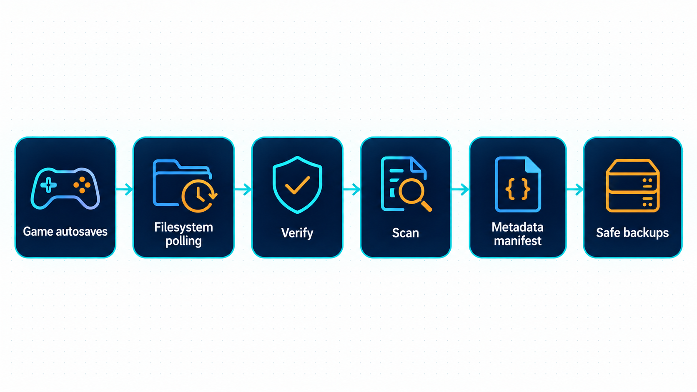

# Backups and restores

SSUI copies complete Stationeers autosaves into `SSUI/savebackups/<SaveName>`. Open **Backups** in the web UI, or visit `/backups`, to inspect, download and restore them.



!!! important
    Safe backups are separate from the game's rotating autosaves, but they are still on your server's storage. Copy them off-host too. A second folder on a dead disk is not much of a disaster-recovery plan.

## Check that backups work

1. Enable game autosave and let Stationeers write a save while simulation is running.
2. Check `saves/<SaveName>/autosave` for the source archive.
3. Wait for SSUI to observe an unchanged file twice, at least 45 seconds apart, then validate and copy it.
4. Open Backups and check the filename, timestamp and world summary. Processing can take longer for large worlds.

The `BACKUP` log reports `Backup handled` when copying and analysis complete. `Backup archived ... deep analysis pending` means the archive exists but statistics need another attempt. A manifest-write warning is separate from whether the archive was copied.

## Inspect or download

The list shows newest backups first. Expand a row to see available world, version, days played, object/network counts and deep statistics such as players and furnaces. These describe the archived save, not the live world.

Select Download to keep the original archive. Discord's `/download` defaults to the newest file and has a 10 MiB cap; use the web UI or filesystem for larger saves.

Every action selects an actual filename, including any nested path. If a file disappears, the action fails; it does not silently choose its new neighbor. Old numeric API selectors and Discord buttons need updating. [API contract](API.md#backups).

## Restore a backup

!!! caution
    Restore replaces the active HEAD save. SSUI does not automatically preserve the previous HEAD. Save and stop the game, then make an independent copy of the active world if you might need to undo this decision.

1. Confirm `SaveName` identifies the world you intend to replace.
2. Save and stop the game using [Save and stop](Server-Operations.md#save-and-stop).
3. Copy the existing world directory somewhere outside the active save path.
4. In Backups, select the required filename and save time, then Restore and confirm.
5. Wait for completion. A failure can leave the server stopped; inspect the error before retrying.
6. Start the server and join it to check the restored state.

| Interface | After a successful restore |
|---|---|
| Web UI / HTTP API | Game remains stopped; you start it |
| Discord admin restore / passed restore vote | Game starts automatically |

Restore preflight checks the selected archive before stopping a running game, then checks again under the backup lock. Storage can still disappear between those checks. Do not run maintenance from several interfaces at once.

## Choose retention

Automatic cleanup is **disabled by default**. Safe copies accumulate until you enable it or manage storage yourself.

In configuration, set these values and enable `backupRetentionEnabled` only after checking your first backups:

| JSON setting | Default | What survives cleanup |
|---|---:|---|
| `backupKeepNewestCount` | `2` | The newest two archives |
| `backupDailyRetentionDays` | `7` | One representative per covered local calendar day |
| `backupWeeklyRetentionWeeks` | `4` | One per covered local ISO week |
| `backupMonthlyRetentionMonths` | `3` | One per covered local calendar month |
| `backupCleanupIntervalHours` | `24` | Hours between cleanup runs |

The retention rules form a union. A file kept by any rule survives, and one file can satisfy several rules. This is not a promise to keep exactly sixteen files. A `0` disables an individual keep rule; setting every keep rule to zero leaves no such protection.

!!! warning
    Cleanup deletes files. Review the resulting history before relying on it. Old retention keys are intentionally not migrated: upgrades reset cleanup to disabled with the new defaults, so you must review and enable the policy again.

Retention uses the save timestamp from `world_meta.xml` and the host's local calendar. Archives without a readable summary are excluded from retention. After safe-backup cleanup succeeds, source autosaves older than 24 hours may also be deleted, but only when a successfully analyzed matching safe archive still exists. Storage/manifest failures block unsafe cleanup.

Invalid negative values or invalid cleanup intervals loaded from JSON/environment disable cleanup and restore safe defaults. The UI/API rejects those values before saving. Exact environment names are in [Configuration](Configuration.md#backup-settings).

## Storage requirements

The directories are derived from `SaveName`:

```text
saves/<SaveName>/autosave/
SSUI/savebackups/<SaveName>/
  backup-meta-manifest.ssui
```

BMv4 polls directory contents; it does not depend on filesystem notifications. SMB/CIFS, NFS and ZFS still need tests of actual file visibility, permissions, rename behavior and reconnects. Polling fixes missing notifications. It does not fix a missing NAS.

Use one SSUI manager per folder pair. Source and archive directories must not overlap, including through symlinks. Configured root symlinks are supported; arbitrary symlinks inside scanned directories are not followed. A mount disappearing behind an ordinary empty directory can look like an empty folder; blocked kernel I/O has no guaranteed cancellation deadline.

For a move, save and stop first, preserve the world and `SSUI` data, and verify ownership at the destination. Manually imported archives are normally discovered after a backup-manager/backend reload. Keep off-host copies independent of retention at the source. The old `saves/<SaveName>/Safebackups` directory is left untouched during the v6 upgrade.

## If a backup is missing

| Observation | Check next |
|---|---|
| No source autosave | Active `SaveName`, Auto Save, paused simulation and game logs |
| Source exists, no safe copy | Writable `SSUI/savebackups`, two stable observations, free space and `BACKUP` errors |
| Archive exists, no statistics | Pending/failed analysis, malformed XML or size limits |
| File disappeared | Retention settings and log, mount availability, external deletion |
| Restore failed | Exact filename, readable archive, destination space and permissions |

Enable debug logging for the `BACKUP` subsystem when diagnosing polling or analysis. [Support packages](Support-Packages.md) describes the collection workflow.

## Processing and recovery reference

<details>
<summary>Polling, archive validation, RAM inventory and manifest recovery</summary>

### How it works

1. Stationeers writes a backup into the active save's `autosave` directory.
2. SSUI scans that directory immediately on startup and then every 45 seconds, measured from the end of the previous scan. No `fsnotify` or operating-system creation event is required.
3. A new file is observed first. If its size and modification time are unchanged at a subsequent scan at least 45 seconds later, handling checks the save archive. Any observed change restarts that interval.
4. Both `world_meta.xml` and `world.xml` must have complete XML structure, the expected root elements, and valid ZIP checksums. The uncompressed limits are 1 MiB for metadata and 1000 MiB for world XML.
5. Handling copies into a temporary file in `SSUI/savebackups/<SaveName>`, validates the copy, reads its summary, and runs the deep scan. Only the completed archive is published under its final name. An analysis failure can leave a valid backup with a readable summary and a pending deep scan.
6. Results enter the RAM inventory and `backup-meta-manifest.ssui`. If cleanup is enabled, SSUI periodically applies retention rules.

SSUI recognizes dated names such as `040926_172441_auto.save` (`DDMMYY_HHMMSS_auto.save`). Its configured save interval defaults to five minutes; source autosave rotation is controlled by the game. SSUI uses the relative filename as the archive identity. Ready new saves take priority over the next older archive awaiting analysis; a scan already running is not interrupted for that priority.

Unarchived files present at startup are eligible too. A successful directory read must observe stability before handling; an incomplete or failed read does not erase prior state. Detection normally takes one to two polling intervals after the file becomes stable, plus validation/copy/analysis time. It is not an unconditional copy exactly 45 seconds after the game creates a file.

Copy, retention, restore and download coordinate their filesystem operations. Lists read the RAM inventory and do not wait for a deep scan. Large-world analysis streams XML rather than retaining the world document in memory.

### Logging

The `BACKUP` subsystem reports each newly archived backup at info level (20), with its filename, byte size and handling duration. `Backup handled` means the copy and deep analysis completed; `Backup archived ... deep analysis pending` means the safe copy exists but analysis still needs another attempt. A separate warning reports a failed manifest write, even when the archive itself was saved successfully.

Debug level (10) adds one summary per autosave poll (files found, observations and queued work), detection and stability changes, validation/copy/scan stages, inventory and manifest updates, background archive analysis, reload state transfer and retention cleanup. Queued counts exclude work already taken by the worker. Missing source storage is reported at debug level while the detector waits and retries. Cached analysis reads do not emit repeated scan messages, and background analysis of existing archives does not produce new-backup info messages.

If a subsystem filter is configured, include `BACKUP`; setting the level to 10 alone does not override that filter. Normal idle polling remains quiet at info level.

### Startup, reload and metadata persistence

On startup, SSUI reconciles the safe-backup directory with the manifest using filenames, sizes and modification times, without opening every archive immediately. Missing, changed, failed or outdated analyses enter a background backlog, newest archive first. Failed analyses are retried on the next manager start or through an explicit analysis request, not continuously in a tight loop.

The manifest is compact JSON containing aggregate values, not world XML, individual things or player records. Runtime lists and completed analysis requests use RAM. Backfill updates are batched every two seconds; handling, retention and shutdown also flush at their commit boundaries. Unchanged state causes no write. Writes use a same-directory temporary file, sync, close and rename.

A missing manifest is rebuilt from the archives. Malformed JSON is preserved as `.invalid-...` before rebuilding. Storage access errors preserve the file and retry initialization after the polling interval; unsupported manifest versions or invalid folder configurations require correction instead. Manually imported archives are normally discovered at the next manager start.

A reload cancels polling/retry waits immediately and inherits pending observations and retention state when both configured paths stay the same. Source validation and deep scans can observe cancellation. Once a copy exists, completing its validation and publication may delay shutdown; a pending deep scan resumes after restart. An already-running download or restore can finish too. An OS read blocked on an unavailable mount has no guaranteed cancellation deadline.

If an expected archive disappears while its original still exists, polling queues the original through the normal stability and handling steps again. Only archives corresponding to still-present originals are checked this way, not the whole history. Intentional retention deletions are recorded separately so they do not cause endless recopying. Existing files are never overwritten by this repair path.


</details>

For concurrency, manifest structure and isolated stress-test commands, see the [developer guide](Developer-Documentation.md#backups).

---

[Documentation home](index.md) · [All guides](index.md#run-your-server)
