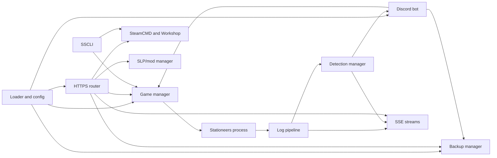

# Developer documentation

SSUI is a Go application with embedded Web UI assets. It manages the Stationeers process, SteamCMD, saves/backups, updates, live log streams, detections, Discord, authentication, TLS, and SLP/Workshop operations from one backend.

This page describes the current source layout. File paths are more reliable than architectural diagrams copied from three rewrites ago.

## Build requirements

- Go version declared by `go.mod` (currently Go 1.26).
- Node.js/npm for rebuilding the Svelte frontend.
- Git.
- Docker when testing the container build.
- A disposable Stationeers server directory for integration testing.

## Repository layout

| Path | Responsibility |
|---|---|
| `server.go` | Application entry point and embedded assets. |
| `src/config` | JSON schema, defaults, environment fallbacks, migrations, getters/setters. |
| `src/core/loader` | Startup sequencing, flags, reload, sanity checks. |
| `src/core/security` | Password hashing, users/groups, sessions, personal tokens and TLS generation. |
| `src/core/ssestream` | SSE connection and message broadcasting. |
| `src/managers/gamemgr` | Stationeers arguments, process lifecycle, state, uptime, restarts, password rotation, logs. |
| `src/managers/backupmgr` | Backup watcher, safe copies, retention, listing, download, and restore. |
| `src/managers/commandmgr` | SSCM command transport. |
| `src/managers/detectionmgr` | Built-in/custom log detections and event publishing. |
| `src/steamcmd` | SteamCMD installation, app info, game updates, and Workshop operations. |
| `src/modding` | SLP installation/configuration, package upload, and installed mod details. |
| `src/worldgen` | Runtime discovery and caching of world, difficulty, condition, and spawn-location catalogs. |
| `src/discordbot` | Bot session, commands, hub dialogs, votes, embeds, event/log output. |
| `src/api` | Shared v3 response contract, authentication middleware and identity handlers. |
| `src/web` | HTTP routing, pages, legacy-handler adapters and SSE endpoints. |
| `src/cli` | Small SSCLI command registry and terminal prompt. |
| `src/setup` | Initial installation, platform support, autostart assets, update system. |
| `src/logger` | Structured subsystem logging and platform-specific behavior. |
| `src/localization` | UI/message localization loading. |
| `frontend` | Newer Svelte frontend source. |
| `SSUI/onboard_bundled` | Assets embedded into the Go binary. |
| `.docker` | Multi-stage Docker build, entrypoint, and Compose example. |

## Runtime flow



## Configuration model

`src/config/config.go` defines `JsonConfig`, default resolution, environment-variable fallbacks, and compatibility migrations. Runtime values are held behind the configuration package's lock and exposed through getters/setters.

When adding a setting, check every required surface:

1. Runtime variable in `src/config/vars.go`.
2. `JsonConfig` field and JSON name.
3. Default/environment application in `applyConfig`.
4. Persistence in `safeSaveConfig`.
5. Getter/setter as required.
6. Web setup/configuration form and localization.
7. Documentation and migration behavior.
8. Tests for defaults, parsing, migration, or validation.

Missing step four creates the delightful configuration option that works until SSUI saves the file.

## HTTP routing and authentication

Routes are registered in `src/web/routes.go` using separate page and API muxes:

- Public routes for login and the minimum required first-owner setup flow.
- Protected pages using session cookies.
- Protected `/api/v3` routes using either session cookies plus CSRF or scoped Bearer tokens.

Adding an API route to the protected mux is the normal default. Give it the narrowest existing permission that fits. A new public route requires an explicit security justification and first-time-setup analysis.

Normal v3 JSON handlers return the shared `data` or `error` envelope from `src/api`. Downloads and SSE streams are the deliberate exceptions. State-changing handlers use an appropriate non-GET method.

## Live streams and detections

Game and backend output are broadcast through SSE managers. Detection processing consumes relevant log lines, produces typed events, and broadcasts those events to the UI/Discord.

When adding a built-in detection:

1. Define or reuse the event type in `src/managers/detectionmgr/types.go`.
2. Add a precise keyword/regex pattern and handler.
3. Test representative matching and non-matching lines.
4. Avoid expensive or overly broad regexes in the hot log path.
5. Decide whether the event belongs in Discord and connected-player state.
6. Document user-visible behavior.

User-created detections are stored separately in `SSUI/config/customdetections.json` and managed by the detection API/UI.

## Process management

All Stationeers start/stop behavior belongs behind `gamemgr` rather than ad hoc `exec.Cmd` calls from handlers. This keeps state tracking, uptime, log collection, scheduled restarts, and platform-specific stopping in one place.

Be careful around:

- Lock ordering and long operations while holding mutexes.
- Duplicate start/update requests.
- Windows versus Linux process/log behavior.
- Backend reloads while Stationeers remains running.
- Stop/update/restart sequences that can leave detached processes.

## Backups

BMv4 lives under `src/managers/backupmgr`. Ordinary functions implement polling, handling and manifest persistence within the existing package; exported methods preserve the older API. See [Backup System](Backup-System.md) for user-facing behavior.

- `watcher.go` performs metadata-only source polls, two-observation stability checks, archive-existence checks for live sources, and complete XML/ZIP validation. Normal polling is 45 seconds, counted after each completed scan.
- `handling.go` has one background worker: ready autosaves first, then the next startup-backfill item. It copies through a temporary file, validates, reads metadata once and streams deep statistics. New work does not preempt an active scan.
- `manifest.go` owns the compact JSON manifest and aggregate RAM inventory. Startup reconciles file identities; runtime lists do not reopen archives. Dirty revisions batch backfill writes; new copies, retention and shutdown also flush.
- `cleanup.go` applies local-calendar buckets using the save timestamp from `world_meta.xml`, not archive mtime. Source cleanup separately uses a 24-hour mtime cutoff and requires a surviving analyzed archive. Persisted retention intent prevents repair from recreating deliberate deletions.
- Operation locking coordinates copy, restore, download and retention. The state lock protects short RAM updates; the scan gate bounds expensive background/on-demand scans. Polling does not wait for an occupied operation lock just to check existing archive paths.
- Reload cancels waits and cancellable scans, finishes publication of an already-copied valid archive, then transfers relevant detector state for identical folder pairs. Storage initialization errors retry, while invalid configuration or a future manifest schema fails explicitly.

The manifest is `backup-meta-manifest.ssui` in each safe-backup folder. It contains relative paths, size/mtime identities, summary and deep aggregate values, analysis version/error state, and processed/retention markers for live sources. Do not retain full XML or individual world objects. Metadata and world XML are capped at 1 MiB and 1000 MiB uncompressed respectively. Invalid game control characters are normalized only during decoding, without changing stored archive bytes.

### Filename selection

`BackupSaveFile` exposes `Name`, `SaveTime` and optional summary metadata. Names are canonical slash-separated paths relative to the safe-backup root, not absolute paths. `selectBackup` validates the name and looks it up directly in the RAM map; no sorted snapshot or numeric compatibility layer is needed for actions. Sorting remains a presentation/retention concern.

`AnalyzeBackup(ctx, name)`, `GetBackupFileData(name)` and `RestoreBackup(name)` share that identity. Download/restore validate the current file identity and resolved path confinement. Pending scans also verify the file before opening it; completed analysis remains a RAM read. `CheckBackupAvailable(manager, name)` gives HTTP/Discord restore callers a preflight before stopping the game; restore checks again under the operation lock. External file changes after preflight can still produce a failure after stopping.

HTTP analysis/restore accept exactly one `name` query parameter; downloads accept JSON `{"name":"..."}`. Invalid selectors are 400, unavailable names are 404. The old `index`, `file` and `saveFile` selection contracts are intentionally removed. The bundled UI, slash commands, buttons and vote menus retain the filename from initial selection through execution. No-argument Discord download captures the latest name once. Oversized Discord component values are omitted, not truncated into a different identity; slash commands remain available.

### Backup validation

Run the regular repository checks with the project's Go toolchain:

```sh
GOTOOLCHAIN=go1.26.0 go test -race ./...
GOTOOLCHAIN=go1.26.0 go vet ./...
node --test SSUI/tests/backup-selection.test.cjs
```

`selection_test.go` covers reordered/deleted selections, nested names, URL/JSON round-trips, old selector rejection, changed archives and symlink escapes. Discord tests cover old command options, registration changes and filename-bound active votes. The dependency-free Node tests execute both shipped backup scripts with a small DOM/fetch stub: they check action payloads after list changes, HTML escaping and restore error messages, not browser layout or the full authenticated stack.

`soak_test.go` adds opt-in running-manager integration tests. All generated saves, destructive operations and restores stay in test temporary directories. A real save is read only as a fixture; dedicated child test processes, never a user server, are killed for crash-recovery checks.

```sh
SSUI_BM_STRESS=1 \
SSUI_ANALYSIS_TEST_SAVE=/absolute/path/to/a/large/complete/autosave.save \
GOTOOLCHAIN=go1.26.0 go test ./src/managers/backupmgr \
  -run '^TestBackupSoak' -count=1 -v -timeout=10m
```

The six scenarios exercise rotation/partial writes/reloads with concurrent HTTP lists, 4000 small archives plus independently rotating autosaves, reload after a large temporary copy exists, manifest publication failure, actual process kills before/after publication, and the unchanged 45-second interval followed by download and isolated restore. Missing `SSUI_ANALYSIS_TEST_SAVE` skips real-save cases; missing `SSUI_BM_STRESS=1` skips the entire soak suite. A tiny real fixture can finish before the crash/reload window is observed, so use a large, complete, static save.

For repeated concurrency checks:

```sh
SSUI_BM_STRESS=1 GOTOOLCHAIN=go1.26.0 go test -race ./src/managers/backupmgr \
  -run '^TestBackupSoakRotationReloadAndHTTP$' -count=20 -timeout=5m
```

For native Windows testing, cross-compile with `GOOS=windows GOARCH=amd64 GOTOOLCHAIN=go1.26.0 go test -c -o /tmp/ssui-backupmgr-tests.exe ./src/managers/backupmgr`. Run the resulting binary from a local Windows working directory with `-test.run=TestBackupSoak -test.v -test.timeout=10m`, setting the same two environment variables and using a Windows-accessible absolute fixture path. Windows fault injection waits for transient open-handle restrictions before renaming a test folder.

The suite does not run a live Stationeers server, the complete web/auth stack, or Discord. Folder renames and blocked manifest paths do not prove CIFS/ZFS reconnect behavior, disk-full handling, power-loss durability or cancellation of blocked kernel I/O. Race instrumentation also greatly increases scan/shutdown time. Validate the actual deployment storage and live integrations separately.

Backup changes require tests for:

- Calendar-day boundaries.
- ISO week/year transitions.
- Month/year transitions.
- `backupKeepNewestCount` interaction and overlap with longer-term buckets.
- Corrupt/missing files.
- Concurrent watcher/list/restore/cleanup behavior.
- Supported filesystem semantics.

Never validate destructive retention behavior only against a developer's real save directory.

## World-generation catalog

`src/worldgen` discovers choices from the installed game's `StreamingAssets/Worlds` directories and `Data/difficultySettings.xml`, filters unsupported entries, and caches the result against a source fingerprint. A bundled fallback keeps the configuration page usable when the game files are absent or unreadable.

The Web UI's comboboxes remain editable because mods can introduce identifiers SSUI has never seen. Preserve the positional validation used by Stationeers: `StartCondition` requires `Difficulty`, and `StartLocation` requires both earlier values.

## Discord

The hub uses role checks for all admin entry points, user/guild/channel-bound private dialogs and a shared Discord execution slot. Votes use a fixed target computed when opened, temporary public panels and filename-pinned restores. This guard does not serialize Web UI/CLI operations. Tests in `hub_test.go`, `vote_test.go` and `backup_selection_test.go` use mocked Discord transport; live permissions/rendering require a separate check.

Slash commands are declared in `src/discordbot/registerSlashcommands.go`. When changing them, update registration equality behavior, handlers, help output, permissions guidance, and the wiki command table together.

Discord API calls are rate-limited. Prefer updating stable panel messages and batching streams over emitting one message per raw log line.

## Frontend

The Svelte source lives in `frontend/src`. Its build output is placed below `SSUI/onboard_bundled/v2` and embedded in the Go binary.

The backend also serves the established embedded UI/configuration assets. Check both the main UI and `/app` before removing a route or field that appears unused from one frontend alone. The `v2` directory name is a build-output detail, not its public URL.

## Building

Build in a disposable checkout. Running SSUI can install/update files, create configuration and start a game; do not run development commands inside a live installation. Output binaries belong in a disposable runtime directory before execution.

Backend checks:

```bash
GOTOOLCHAIN=go1.26.0 go test ./...
GOTOOLCHAIN=go1.26.0 go build -o /tmp/ssui-dev ./server.go
```

Frontend:

```bash
cd frontend
npm ci
npm run build
```

Docker:

```bash
docker compose -f .docker/compose.yml build
```

Use the repository's locked dependency files. Do not run `go mod tidy` as a generic “install dependencies” step unless you intend to review and commit module-file changes.

## Testing expectations

At minimum, test the affected layer plus a realistic integration path:

- Configuration changes: load, migrate, save, reload.
- Web changes: unauthenticated/authenticated behavior and method handling.
- Process changes: start, ready detection, stop, failed start, repeated requests.
- Backup changes: temporary directories and retention edge cases.
- Detection changes: matching, capture groups, non-matches, concurrency/state.
- Discord changes: registration shape and handler behavior without a real token where possible.
- Update changes: mocked metadata/download decisions before testing a real replacement.

## Contributions

Read [Contributing](Contributing.md) and the repository license before publishing a fork or redistributed build. Open an issue or talk to the project before large architectural work so two people do not independently rewrite the backup manager for sport.

---

[Documentation home](index.md) · [All guides](index.md#run-your-server)
