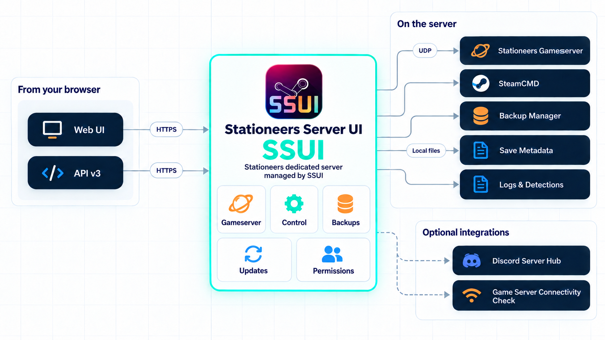

# What SSUI does

SSUI is the management layer around one Stationeers dedicated server. It handles the repetitive parts, exposes the important controls in a browser and tries very hard not to become another full-time game you have to maintain.

<a class="ssui-card" href="#set-up-and-run-stationeers"><strong>Run the station</strong>Setup, worlds, players, ports and daily server control.↓</a>
<a class="ssui-card" href="#keep-saves-recoverable"><strong>Keep saves recoverable</strong>Stable autosave handling, analysis, retention and restore.↓</a>
<a class="ssui-card" href="#share-access-without-sharing-the-owner-password"><strong>Share access safely</strong>Users, groups, permissions and personal API tokens.↓</a>
<a class="ssui-card" href="#diagnose-the-weird-stuff"><strong>Find the weird stuff</strong>Logs, detections, support packages and useful failure paths.↓</a>

!!! tip
    SSUI is the control layer around the game server. It does not replace your firewall, your off-host backup plan or the occasional need to ask a human for help.

## Who this is for

SSUI is useful at three different moments:

- **The first server:** the installer and setup wizard get SteamCMD, Stationeers, the world and the owner account into a known state.
- **The existing server:** the dashboard, backups, update flow and Spacecat check make the daily jobs visible instead of hiding them in a terminal.
- **The small admin team:** People & Access, API tokens and the Discord hub let several people help without passing one owner password around.

You do not need to be a Linux administrator to use the WebUI. You do need to know which machine hosts the server, which port players use and where your backups should live. The docs will help with the first two; physics remains stubbornly outside the product roadmap.

## Core concepts

SSUI becomes easier to reason about when its jobs stay separate:

| Part | What it is responsible for |
|---|---|
| **Stationeers** | The actual gameserver, world simulation, players and game saves. |
| **SSUI** | The web interface, process control, configuration, updates and runtime checks around the game. |
| **Backup Manager** | Polling the game's autosaves, waiting for stable files, analyzing completed saves and retaining archives. |
| **API and Discord** | Alternative control surfaces for people and automation with their own permission checks. |

That separation explains a few otherwise surprising behaviors. Spacecat checks the gameserver port, not the SSUI web port. A backup can be visible in the game-managed autosave folder before SSUI considers it ready to archive. A user can see a status value without having permission to change the thing that produced it.

## Set up and run Stationeers

- Install SteamCMD and the Stationeers dedicated server from one executable.
- Configure worlds, players, ports, autosaves, restarts and game branches in the web UI.
- Start, stop, update and monitor the game without keeping an administrator attached to its terminal.
- Read live game output, parsed events and SSUI subsystem logs.
- Send allowed Stationeers server commands through SSCM.
- Check whether the actual gameserver UDP port is reachable from the internet with Spacecat.

## Keep saves recoverable

Backup Manager v4 does not depend on filesystem notification support. It polls the game's autosave folder, waits for saves to become stable, validates the required XML files and copies finished saves into SSUI-managed archives.

Each archive is analyzed when handled. SSUI keeps compact metadata in a manifest, can fill in analysis for older archives in the background and lets permitted users inspect, download or restore backups by filename. Retention can preserve newest, daily, weekly and monthly snapshots.

In shorter terms: Stationeers keeps five rotating autosaves; SSUI gives those saves a career plan.

## Use the server from Discord

The Discord integration can maintain a shared server-status hub with player state, recent backup information and buttons for common actions. Admin controls are gated by a configured Discord role and use private interaction responses where appropriate.

Optional vote panels let players request restarts or restores without turning a public channel into a slash-command archaeological site. Event and log channels remain available for communities that want them.

## Share access without sharing the owner password

Authentication is mandatory in v6. Owners can create users, choose permission presets or fine-tune individual capabilities, and revoke access. People without a permission see a clear refusal instead of a button that silently performs interpretive dance.

Users can create scoped personal API tokens only within their own permissions. The HTTP API follows one v3 response contract for status, data and errors.

## Run mods and custom detections

- Install and manage StationeersLaunchPad packages.
- Download supported Workshop content through SteamCMD.
- Turn game-log text or regular expressions into named events.
- Feed useful activity into the web interface and Discord instead of reading every line manually.

## Diagnose the weird stuff

Startup sanity checks catch common permission and directory problems early. The troubleshooting pages explain the common failure paths, and support packages collect relevant logs and sanitized configuration for the SSUI Discord team.

SSUI is not a replacement for host backups, firewall rules, monitoring or knowing where the machine lives. It is also unable to prevent players from opening both airlock doors. Scope must exist somewhere.

Ready to try it? Start with [requirements](Requirements.md), [installation](Installation.md) or the [quick start](Quick-Start-Guide.md).

---

[Documentation home](index.md) · [Getting started](Getting-Started.md)
