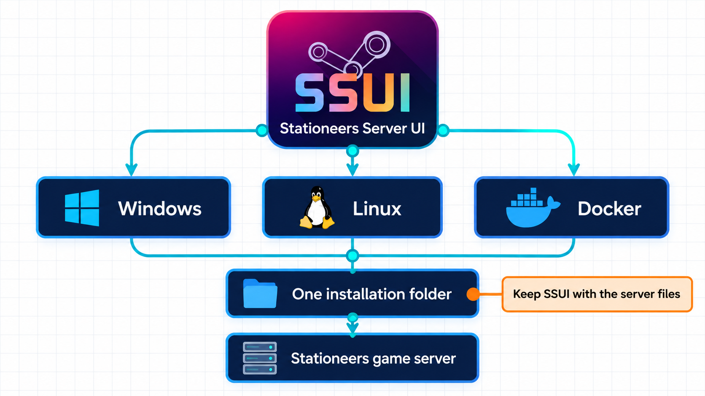

# Install SSUI

Choose one platform below. Windows and Linux use one executable; Docker has its own image. The normal native path is intentionally short: put the executable in a writable folder, run it and continue in the browser. SSUI prepares SteamCMD and the Stationeers server for you.

!!! tip "What you actually have to do"
    Download SSUI, place it in an empty folder, run it, open the browser page and click through setup. You only need to make extra decisions when you have an existing world, a custom network layout or a deployment that is not a normal native installation.

Some server management tools are practically an infrastructure project before they manage anything. SSUI is not.

No PHP stack. No database deployment. No panel-of-panels to assemble before the server can even start. SSUI is one executable, sensible defaults and a setup wizard - because managing a Stationeers server should not require managing another server first.

Before starting, check the [requirements](Requirements.md) and download the current release from the [SSUI download page](https://ssui.dev/).



## Windows

### 1. Create the installation folder

Create a new folder where your Windows user can freely create and change files. A good default:

```text
%USERPROFILE%\Documents\SSUI
```

Move the downloaded `.exe` into it. Do not install SSUI in `Program Files`, the root of `C:\`, or your Stationeers game-client folder. Windows has enough interesting permission behavior without asking it for more.

### 2. Install the game runtime

The Stationeers server on Windows needs Microsoft's current [Visual C++ Redistributable for Visual Studio 2015-2022](https://learn.microsoft.com/en-us/cpp/windows/latest-supported-vc-redist). Install the x64 package if it is not already present. This is a game-server dependency, not a dependency of the SSUI web interface.

### 3. Run SSUI

Double-click the executable, or open PowerShell in that folder and run its actual filename:

```powershell
.\StationeersServerUI_v6.0.0_windows_amd64.exe
```

Keep the console open. SSUI installs SteamCMD at `C:\SteamCMD`, then SteamCMD downloads Stationeers into the SSUI installation. The WebUI will only be available after SteamCMD has run initially. 
Your Windows account needs write access to both locations.

Allow the Stationeers server through Windows Firewall when prompted.

Continue at [watch the first installation](#watch-the-first-installation).

<details>
<summary>PowerShell says the executable cannot run</summary>

Confirm that you downloaded the Windows amd64 `.exe`, not the Linux file. If Windows marked the download as blocked, open the file's **Properties**, review its source and use **Unblock** only if it came from the official SSUI release page.

Do not permanently disable Defender or SmartScreen to install a game server. That is less troubleshooting and more opening negotiations with every executable on the internet.

</details>

## Linux

The documented native Linux choices are Ubuntu Server 24.04 LTS and above and Debian 13 (and above). **Run SSUI as an ordinary user, not as root.* 

**Root is rejected outside the official container.**

### 1. Install the SteamCMD dependencies

```bash
sudo apt-get update
sudo apt-get install -y lib32gcc-s1
```

SSUI can attempt to install those libraries through prompting to use `sudo`, but doing it yourself doesn't hurt you.

### 2. Create a home for SSUI

```bash
mkdir -p "$HOME/ssui"
cd "$HOME/ssui"
```

Move the downloaded Linux file into this folder, then use its actual filename:

```bash
chmod +x ./StationeersServerUI_v6.0.0_linux_amd64
./StationeersServerUI_v6.0.0_linux_amd64
```

Keep the terminal open. SSUI expects its installation directory to remain its working directory and checks that it can write there.

!!! important
    Do not solve a permission error with `sudo ./StationeersServerUI...`. Fix ownership of this specific installation folder instead. Native SSUI deliberately refuses to run as root.

<details>
<summary>Using another Linux distribution</summary>

The installer contains dependency handling for RHEL-family systems using `libgcc.i686` and `libstdc++.i686`, but that is not the recommended beginner path or a promise that every build supports the distribution. Ubuntu LTS, Debian 13 or the official container are the maintained documentation paths. We are trying our best with RHEL though, so feel free to try and let us know if it worked.

</details>

## Docker

If you already operate Docker, use the [Docker guide](Docker-Guide.md). The image includes the required runtime, keeps the full installation under `/app`, reports available SSUI updates and expects you to update by pulling a new image.

Do not run the native Linux steps inside the published container. That would be a container containing an installation pretending not to be a container, which is how documentation acquires folklore.

## Watch the first installation

On first run, SSUI:

1. checks whether an SSUI update is available;
2. creates its runtime directories;
3. downloads and starts SteamCMD;
4. installs or updates the Stationeers dedicated server; and
5. starts the HTTPS interface.

SteamCMD uses anonymous login. You do not enter your personal Steam account or password.

Read the console until the web server starts. A first installation can take several minutes depending on Steam and your connection. If SteamCMD reports an error, do not ignore it merely because SSUI later prints another cheerful line.

For a brand-new v6 installation, the setup wizard lets you create the first owner directly. Finish that step before exposing the administration interface to an untrusted network.

## Open the browser

From the server itself, open:

```text
https://localhost:8443
```

From another computer on the same network, use the server's LAN address:

```text
https://192.168.1.50:8443
```

Replace the example address with the real one. Use `https`, not `http`.

The first certificate is self-signed, so the browser will warn you. Verify that the address belongs to your server, then continue. A self-signed warning on first contact is expected; a warning on some unrelated address is not an invitation to become adventurous.

!!! warning
    Keep TCP `8443` private while setup is unfinished. It is the complete administration interface. Players need the Stationeers game port, not this port.

If the page does not open, check the console first, then see [Web UI does not open](Troubleshooting.md#web-ui-does-not-open).

Continue with [first-time setup](First-Time-Setup.md).

## Upgrading from SSUI v5

!!! note "Most v5 upgrades are straightforward"
    If you use the WebUI, a normal native installation and ordinary local storage, v6 is intended to be a safe upgrade path. Read the notes carefully if you use the API directly, old numeric backup indexes, split Docker mounts, custom storage or scripts built around v5 behavior. Those are the places where the upgrade is deliberately breaking instead of quietly pretending nothing changed.

Keep a copy of the complete installation before a major upgrade. On its first v6 start, SSUI copies managed data from the old `UIMod` folder into the new `SSUI` folder and leaves `UIMod` untouched for rollback. Existing saves and old safe-backup directories are left where they are.

If the new `SSUI` folder already contains migrated data, SSUI does not repeatedly merge the old folder into it. Read the v6 release notes before deleting anything from a v5 installation.

---

[Documentation home](index.md) · [First-time setup](First-Time-Setup.md) · [Troubleshooting](Troubleshooting.md)
