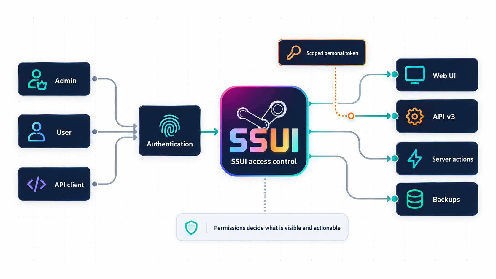

# Access and HTTPS

An SSUI account can manage the game, change configuration, restore worlds and request software updates. Treat it as a server-administration account.

## Accounts and sessions

Authentication is mandatory in SSUI v6. A new installation opens a limited first-owner setup flow before normal login exists. Complete it before exposing the administration interface to an untrusted network.

Sign out, then verify that protected pages require login. Use a unique password and grant users only the groups they need. Web accounts do not use the Discord admin-role boundary.

Browser sessions use a secure HTTP-only cookie, expire after 24 idle hours and have an absolute 30-day lifetime. State-changing browser requests also require a same-origin CSRF value. API integrations use separately revocable, scoped personal access tokens. See [API authentication](API.md#authentication).

!!! important
    Logout revokes the current browser session. Changing or disabling a user revokes that user's credentials. Keep personal access tokens private and revoke a token immediately if it may have leaked.

Lost your login? The local [recovery flag](Command-line-flags.md#recovery-user) creates or replaces an owner account named `recovery` and revokes that account's existing sessions and tokens. Use a temporary credential and change it after signing in.

## Manage people and access

Open **Edit Config**, then select **People & Access**. What appears there depends on your own permissions:

- **Your account** is available to every signed-in user and changes only that user's password.
- **People** lets an administrator create, disable and remove users or assign an access group.
- **Access groups** offers presets for common roles and a fine-tune view for individual permissions.
- **API access** creates and revokes personal access tokens when the user has `tokens.manage`.

For most communities, start with a preset and remove anything the person does not need. A moderator who can start the server and read backups probably does not also need permission to replace TLS certificates, create owners and install SSUI updates.

Important permission pairs are deliberately separate:

| Read permission | Action permission | What that separation means |
|---|---|---|
| `server.view` | `server.control` | See status without starting or stopping the game |
| `console.read` | `console.write` | Read output without sending game commands |
| `backups.view` | `backups.download`, `backups.analyze`, `backups.restore` | See archives without copying or replacing world data |
| `settings.view` | `settings.manage` | Read configuration without changing it |

Without a view permission, the related data is not inserted into the page merely to be hidden with CSS. Without an action permission, SSUI refuses the request in the backend and shows a red notification. The disabled button is a courtesy; the permission check is the lock.

An access group cannot grant permissions its creator does not have. Personal API tokens are limited twice: by the scopes selected at creation and by the token owner's current permissions. Removing a permission from the owner therefore also removes it from existing tokens.

!!! tip
    Give every human a separate account. Shared accounts make revocation awkward and turn the audit trail into "someone did something," which is information in only the broadest philosophical sense.

## Limit network access

SSUI binds its HTTPS listener to `0.0.0.0`, port `8443` by default. Use a private LAN/VPN or restrict firewall source addresses. Players need the game port; they do not need the management port.

If you use a reverse proxy, retain HTTPS to SSUI, pass cookies, preserve the original host, allow long-lived SSE responses, and disable caching of management requests. State-changing v3 routes no longer use GET.

Debug startup also opens an unauthenticated profiling listener on **`0.0.0.0:6060`**. Keep that port private. Disabling the debug setting later is not a listener shutdown; restart SSUI without debug enabled if it was started that way.

## Use your own certificate

1. Prepare a certificate for the hostname you use and its matching unencrypted private key.
2. Save and stop the game before the SSUI restart.
3. Open the TLS certificate controls in configuration, select both files and submit.
4. Wait for SSUI to restart, reconnect with the certificate's hostname and verify the browser now trusts it.

The upload accepts PEM/DER X.509 certificates and unencrypted PKCS#8, RSA PKCS#1 or EC SEC1 private keys, with a 4 MiB request limit. It validates the matching pair, writes the active files below `SSUI/tls/` and schedules an SSUI restart.

!!! warning
    Startup certificate checks can replace an expired certificate, or one expiring within ten days, with a self-signed certificate. This applies to uploaded certificates too. Renew custom certificates before that window; SSUI is not an ACME renewal client.

Generated certificates and browser warnings

Generated certificates last 90 days and name `localhost`, `ssui.local` and loopback addresses. Connecting by a LAN IP can therefore produce a hostname warning as well as an untrusted-issuer warning. Verify your host during initial setup; a warning on a previously trusted deployment needs investigation.

## Discord access

The shared hub can be member-visible. Administration requires `discordAdminRoleID` on every interaction; Discord Administrator alone does not bypass it. Votes and rotating join codes depend on channel access. Keep event/verbose logs private. [Discord setup](Discord-Integration.md#verify-access).

## Protect files and diagnostics

Keep `SSUI/config/config.json`, `SSUI/security/identity.json`, TLS keys and authentication cookies private. The identity file contains password, session and token hashes and is written with owner-only permissions where the platform supports them. Run native SSUI under an account that can write the complete `SSUI` tree and read the complete `saves` tree without unnecessary access elsewhere. Startup checks those permissions. Mods execute code; choosing a Workshop item is a trust decision.

[Support packages](Support-Packages.md) remove known configuration secrets, not arbitrary secrets from log text. Review the archive before sharing it. Backups also contain world/player information.

Which external services does SSUI contact?

The current updater queries GitHub release metadata and downloads matching assets. The former `fieldData` payload described in older documentation is absent from this source. `IsUpdateEnabled=false` disables SSUI check/apply calls; development builds also skip self-updates. SteamCMD, Discord and Workshop traffic have their own behavior.

---

[Documentation home](index.md) · [All guides](index.md#run-your-server)
