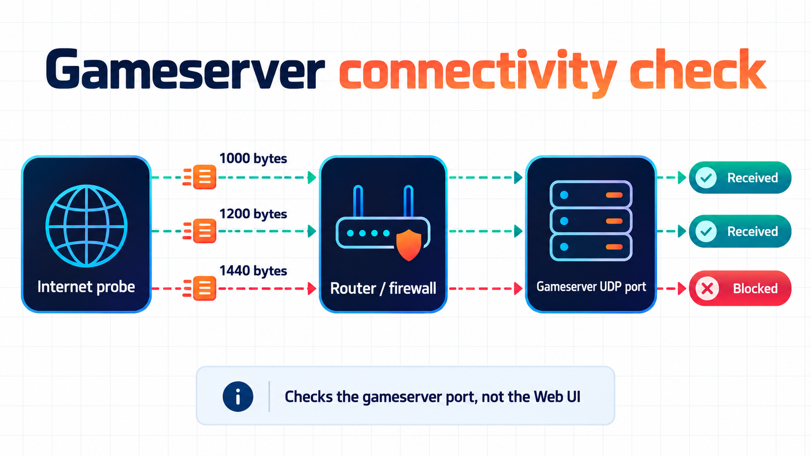

# Server operations

Use the web dashboard for everyday control, or [SSCLI](SSUICLI-Commands.md) in the terminal where SSUI is running. Discord has the same core actions through its [server hub](Discord-Integration.md).

## Spacecat: check gameserver reachability

The dashboard's **Spacecat** check answers one small but expensive question: can traffic reach the configured **Stationeers gameserver UDP port from the internet**? It is not a check of the SSUI web port, and it is not a promise that every player's ISP will behave.

The check runs while the gameserver is stopped. SSUI temporarily reserves the configured `GamePort`, asks the external probe service to send UDP packets and reports which test sizes came back. The default probes are `1000`, `1200` and `1400` bytes. A partial result is useful: it can point at MTU or firewall handling even when small packets work.

Spacecat is enabled by default and can be disabled with `ConnectivityCheckEnabled`. A red result usually means port forwarding, host firewall, Docker publishing, the advertised address or carrier-grade NAT needs attention. A green result means the probe reached the gameserver port; still test an actual player connection from the network your players use.

Use **Run check again** after changing the router, firewall, `GamePort` or `AdvertiserOverride`. The status can be read with `server.view`; starting another check requires the server-control permission. The check is a diagnostic service, not a telemetry store for your world or player data.

## Start and monitor

Select Start in the dashboard or type `startserver` in SSCLI. Follow the console through startup, world loading and session registration. SSUI tracks these stages separately; player count is not the readiness check.

Console shows game output, Events shows parsed activity, and Logs shows SSUI's own messages. A world-saved event also establishes healthy running state. Test an actual player connection before declaring a new network configuration working.

**Auto Start Server on Startup** starts Stationeers after SSUI initialization. It does not install an operating-system service or arrange for SSUI itself to launch after a reboot. The built-in autostart-script call is currently disabled. Configure your service/supervisor separately with the installation directory as its working directory and only one SSUI process per installation.

## Save and stop

1. Send `save` through the game-command input with SSCM enabled.
2. Wait for the world-saved event. Command submission alone does not acknowledge that the game finished saving.
3. Stop through the dashboard, `stopserver`, or the Discord admin action.
4. Confirm Stopped before copying live files, changing mods or shutting down the host.

!!! warning
    Ordinary Stop does not send a save command. Windows kills the game process. Linux sends SIGTERM and falls back to killing it after a timeout. Save first; the Stop button cannot recover changes that were never written.

To exit SSUI interactively, use `exit` in SSCLI after stopping the game. On `SIGTERM` or an interrupt, SSUI gives the managed game process and backup manager up to 25 seconds to stop before exiting. A second signal forces an immediate exit.

Signal handling is damage control, not a save acknowledgement. For planned host or container maintenance, send `save`, wait for the world-saved event and stop Stationeers through SSUI first.

## Update Stationeers

1. Save and stop the game using the procedure above.
2. Run **SteamCMD** in the web UI or enter `runsteamcmd` in SSCLI.
3. Wait for SteamCMD to report success; inspect errors before proceeding.
4. Start the game and check its reported build and player connectivity.

SteamCMD normally also runs during SSUI startup. `AllowAutoGameServerUpdates` controls additional automatic game-update behavior; disabling it does not mean startup never runs SteamCMD. Manual SteamCMD and Discord Update leave the game stopped.

!!! important
    Stop and verify before a manual update. The shared SteamCMD function attempts to stop a running server but currently logs a stop error and continues. Do not use it as a substitute for checking shutdown.

## Update SSUI

The dashboard checks for releases and offers the useful newer versions in its update dialog. Stable, major and prerelease candidates are labelled separately. A manual installation can select any offered version with a matching release asset, but major and prerelease targets each require their own explicit confirmation.

`IsUpdateEnabled` defaults to true. `AllowMajorUpdates` and `AllowPrereleaseUpdates` default to false and control which release automatic/startup updates may select; they do not hide newer releases from an administrator reviewing the dialog.

Before installing, save the world and keep a copy of the installation data. SSUI downloads the exact release you reviewed, stops Stationeers if it is running, starts the new executable and lets the browser reconnect. If the game cannot be stopped cleanly, the updater currently logs a warning and continues, so a manual save and stop before a major upgrade remains the sensible path.

In SSCLI, `update` checks and `applyupdate` applies the candidate permitted by the automatic-update policy. For [Docker](Docker-Guide.md#update-the-container), the UI reports the available version but the container image owns the executable; pull and recreate the image instead. Game-server updates through SteamCMD are a separate system. See [update configuration](Configuration.md#updates).

## Schedule restarts

Set `AutoRestartServerTimer` in configuration:

| Value | Schedule |
|---|---|
| `0` | Disabled, the default |
| `720` | Every twelve hours of this server run |
| `22:30` | Daily at 22:30 in the host's local time |
| `10:30PM` | The same daily time in 12-hour notation |

For 12-hour notation, use exactly `HH:MMAM` or `HH:MMPM`: the two-digit hour and minute are followed immediately by an uppercase `AM` or `PM` suffix. For example, `10:30PM` works; `10:30 PM` and lowercase suffixes do not match the accepted format. The host or container's local timezone is used.

Restart the game after changing the schedule. The timer is created when the game starts. Check the next restart in the status view and the host/container timezone.

At the scheduled time, SSUI starts the warning sequence, then stops the game, waits five seconds and starts it again. With SSCM enabled it sends announcements and `save` near the end. `AutoRestartCountdown` defaults to `65`; invalid values or values below five fall back to 60 seconds.

The displayed schedule is when the sequence begins, not an exact instant at which players reconnect. The implementation uses fixed delays and does not wait for a save-completion acknowledgement. With SSCM disabled, warnings and the explicit save are skipped.

## Autosave and auto-pause

Auto Save defaults to on, with `SaveInterval` of `300` seconds. Auto Pause defaults to on when no players are connected. If you need an empty server to keep simulating, change that deliberately. The plants will appreciate being consulted. They will not be consulted.

Check [backup retention](Backup-System.md#choose-retention) separately: game autosave and SSUI's archive cleanup are different settings.

## Reload configuration or components

| Command | Effect |
|---|---|
| `reloadconfig` | Read configuration from disk |
| `reloadbackend` | Reload configuration and components including backups, SSCM and Discord |
| `restartbackend` | Restart the SSUI process flow |

Use the UI for live edits. For manual JSON changes, stop SSUI first so its own writes cannot overwrite your edits. Restart Stationeers for launch arguments; restart SSUI for listener changes such as the web port. A backend reload is not a game restart.

---

[Documentation home](index.md) · [All guides](index.md#run-your-server)
