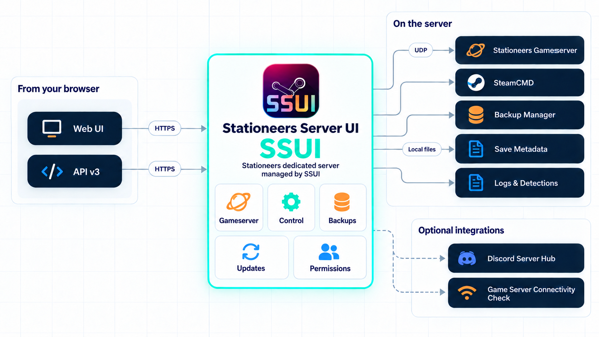

A simple Stationeers dedicated server setup

<h1>Stationeers Server UI</h1>

Drop one executable into a writable folder, run it and click through the setup wizard. SSUI gets your Stationeers dedicated server running and takes care of the boring work after that.

<a class="md-button md-button--primary" href="Installation/">Install SSUI</a> <a class="md-button" href="Downloads/">Downloads</a> <a class="md-button" href="Features/">See what it does</a>

SSUI takes care of the repetitive parts around a Stationeers dedicated server: SteamCMD, setup, daily operation, backups, updates, mods, Discord controls and the logs that tell you which part of the station caught fire first.

Some server management tools are practically an infrastructure project before they manage anything. SSUI is not. Download one executable, run it, click through setup and get a Stationeers server. Everything else is optional.

!!! tip "The normal path is deliberately boring"
    Download one file, put it in a folder SSUI can write to, run it and follow the browser setup. You do not need to understand the API, Discord integration or every setting to get a server online. The one part SSUI cannot configure for you is your network: players still need the gameserver port forwarded and allowed through the firewall.

!!! note "The short version"
    SSUI is the control layer around one Stationeers server. It is not a replacement for a firewall, an off-host backup or the person who knows where the machine is plugged in. It is the bit that gives those jobs a sensible browser, a repeatable workflow and fewer opportunities to type the wrong command at 03:00.

<strong>Web UI + API v3</strong>Operate it from your browser

<strong>Windows, Linux or Docker</strong>Pick the deployment that fits

<strong>Backups by filename</strong>Recover the save you actually mean

<strong>Discord-ready</strong>Status and admin workflows when useful

## New here?

The [installation guide](Installation.md) is the place to start. It contains the supported platforms, platform-specific dependencies and copyable commands. You do not need to read the entire documentation before running SSUI.

As a rough baseline, you want:

- a 64-bit Windows or Linux host (or an amd64 Docker host);
- 8 GB RAM for a small server, 16 GB if you want comfortable headroom;
- 20 GB of free SSD space, plus whatever your backup history needs; and
- control over the firewall and router if people will connect over the internet.

Then follow these three steps:

1. [Install SSUI](Installation.md). The normal path is download, put it in an empty folder and run it.
2. [Complete the first-time setup](First-Time-Setup.md).
3. Start the server and verify that SSUI can create one backup.

Not sure whether the host is large enough? The [requirements and sizing](Requirements.md) page has the longer answer. Already know your way around a server? The [quick start](Quick-Start-Guide.md) gets the ceremony out of the way.

!!! tip
    You do not need a graphical desktop on the server. SSUI runs there; the web interface opens in a browser on your own computer.

## Choose your route

<a class="ssui-card" href="Installation/"><strong>Install a new server</strong>Platform requirements, commands and the first browser login.→</a>
<a class="ssui-card" href="Upgrade-Guide/"><strong>Coming from v5</strong>See what is copied, what stays in place and what changed on purpose.→</a>
<a class="ssui-card" href="Docker-Guide/"><strong>Run it in Docker</strong>One bind-mounted application directory, one container, fewer surprises.→</a>
<a class="ssui-card" href="Troubleshooting/"><strong>Something is broken</strong>Start with the symptom and collect useful evidence before guessing.→</a>

Already installed? Go straight to [first-time setup](First-Time-Setup.md), or use [server operations](Server-Operations.md) if the station is already running.

## How these docs are arranged

<a class="ssui-card" href="Getting-Started/"><strong>Getting started</strong>Choose a platform, install SSUI and create the first owner.</a>
<a class="ssui-card" href="Features/"><strong>Run your server</strong>Learn the dashboard, backups, Discord hub, mods and diagnostics.</a>
<a class="ssui-card" href="Troubleshooting/"><strong>Troubleshooting</strong>Follow a symptom to the right layer instead of changing everything.</a>
<a class="ssui-card" href="Configuration/"><strong>Reference</strong>Exact settings, API routes, CLI commands and developer notes.</a>

The **Legacy** tab keeps the v5 documentation available for existing installations and records what changed in the early v1-v4 branches. It is deliberately loud about being old. If a current page and a legacy page disagree, the current page wins for v6.

!!! info "How to use this documentation"
    Follow a guide when you are doing something for the first time. Use the sidebar or search when you already know the name of the thing you need. Use **Reference** for exact settings, API routes and commands. If the server is already misbehaving, go directly to [Troubleshooting](Troubleshooting.md) and ask in the [SSUI Discord](https://discord.gg/8n3vN92MyJ) before deleting the evidence.

## Run your server

| I want to... | Read this |
|---|---|
| See what SSUI can do | [Features](Features.md) |
| Start, save, stop or update the server | [Server operations](Server-Operations.md) |
| Understand the dashboard and pages | [Web interface](Web-Interface.md) |
| Inspect, download or restore a save | [Backups and restores](Backup-System.md) |
| Let Discord users check or control the server | [Discord integration](Discord-Integration.md) |
| Install LaunchPad or Workshop mods | [Modding](Modding-with-StationeersLaunchPad.md) |
| Add custom log detections | [Logs and detections](Log-Detection-System.md) |
| Add users, permissions or API keys | [Access and HTTPS](Security-Considerations.md) |
| Fix something that is already on fire | [Troubleshooting](Troubleshooting.md) |
| Ask a human for help | Read [Get help](Support.md), then visit [Discord](https://discord.gg/8n3vN92MyJ) |

## Reference shelf

These pages are useful when you need one exact setting rather than a guided tour:

[Configuration](Configuration.md) · [SSCLI commands](SSUICLI-Commands.md) · [Startup flags](Command-line-flags.md) · [Game commands / SSCM](Allowed-SSCM-commands.md) · [HTTP API](API.md) · [Developer guide](Developer-Documentation.md)

## Version scope

This documentation follows the SSUI v6 development line. Version 5 has different account management, API routes, backup controls and Discord panels. Use the documentation shipped for your release while upgrading.

[Download SSUI](https://ssui.dev/) · [GitHub](https://github.com/SteamServerUI/StationeersServerUI) · [Report an issue](https://github.com/SteamServerUI/StationeersServerUI/issues) · [Discord support](https://discord.gg/8n3vN92MyJ)
