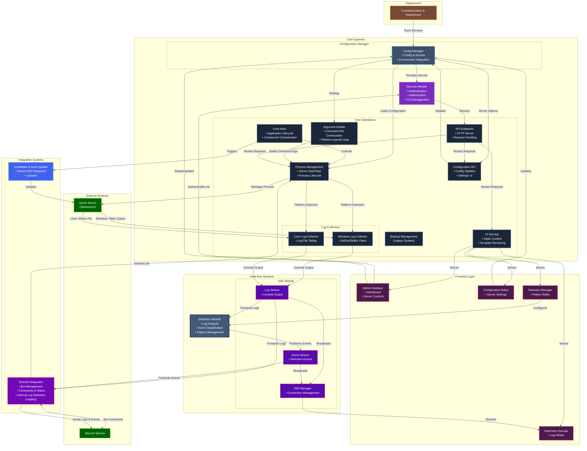

!!! danger "⚠️ LEGACY DOCUMENTATION"
    This page describes the old SSUI v5 documentation and is kept for reference only. It does not describe the current SSUI v6 release, API, paths or security model.

    For a new installation, start with the [current v6 documentation](../../index.md).

## 📋 Overview

The Stationeers Server UI provides comprehensive management for Stationeers dedicated servers through both web and Discord interfaces. This documentation outlines the codebase architecture, components, and integration points for developers.

## 🏗️ System Architecture

The system employs a layered architecture with clear separation of concerns:

```mermaid
flowchart LR
    %% Core Systems
    subgraph "Core Systems"
        Config["Configuration Manager<br>• Config & Secrets<br>• Environment Integration"]:::config
        Core["Core Operations<br>• Process Management<br>• Backup Handling<br>• API Endpoints<br>• Log Collection (serverlog.go)"]:::core
        Sec["Security Module<br>• Authentication<br>• Authorization<br>• TLS Management"]:::security
    end

    %% Real-time Systems
    subgraph "Real-time Systems"
        Det["Detection Module<br>• Log Analysis<br>• Event Classification<br>• Pattern Management"]:::detector
        SSE["SSE Module<br>• Log Stream<br>• Event Stream<br>• Connection Management"]:::sse
    end

    %% Integration Systems
    subgraph "Integration Systems"
        Disc["Discord Integration<br>• Bot Management<br>• Commands & Status<br>• Internal Log Detection (Legacy)"]:::discord
        Install["Installation & Auto-Updater<br>• SteamCMD Integration<br>• Updates"]:::installer
    end

    %% Frontend Layer
    subgraph "Frontend Layer"
        UI["Web UI (UIMod)<br>• Admin Interface<br>• Real-time Console"]:::frontend
    end

    %% External Systems
    subgraph "External Systems"
        DS["Discord Service"]:::external
        GS["Game Server<br>(Stationeers)"]:::external
    end

    %% Deployment Layer
    subgraph "Deployment"
        Deploy["Containerization & Deployment"]:::deployment
    end

    %% Primary Data Flows
    Config -->|"Provides Secrets"| Sec
    Config -->|"Loads Configuration"| Core
    
    %% Core & Log Flow
    Core -->|"Manages"| GS
    GS -->|"Produces Logs"| Core
    Core -->|"Broadcasts Logs"| SSE
    SSE -->|"Forwards Logs"| Det
    SSE -->|"Forwards Logs if Enabled"| Disc
    
    %% Event Flow
    Det -->|"Publishes Events"| SSE
    
    %% User Interface Flows
    Core -->|"Provides API"| UI
    SSE -->|"Streams (Logs & Events)"| UI
    
    %% Security & Authentication
    Sec -->|"Secures"| Core
    UI -->|"Authenticates via"| Sec
    
    %% Discord Integration
    Disc <-->|"Bot Commands"| DS
    Core -->|"Status Updates"| Disc
    
    %% Installation & Updates
    Install -->|"Updates"| GS
    Core -->|"Triggers"| Install
    
    %% Deployment
    Deploy -->|"Runs Services"| Core
    
    %% Styling classes - Dark mode friendly colors
    classDef config fill:#3a506b,stroke:#5bc0be,stroke-width:2px,color:#ffffff;
    classDef core fill:#1b263b,stroke:#778da9,stroke-width:2px,color:#ffffff;
    classDef detector fill:#415a77,stroke:#0d1b2a,stroke-width:2px,color:#ffffff;
    classDef discord fill:#7209b7,stroke:#f72585,stroke-width:2px,color:#ffffff;
    classDef installer fill:#4361ee,stroke:#4cc9f0,stroke-width:2px,color:#ffffff;
    classDef security fill:#7b2cbf,stroke:#c77dff,stroke-width:2px,color:#ffffff;
    classDef sse fill:#560bad,stroke:#f72585,stroke-width:2px,color:#ffffff;
    classDef frontend fill:#4d194d,stroke:#ff758f,stroke-width:2px,color:#ffffff;
    classDef external fill:#006400,stroke:#90ee90,stroke-width:2px,color:#ffffff;
    classDef deployment fill:#774936,stroke:#e09f3e,stroke-width:2px,color:#ffffff;
    
    %% Click Events for Component Mapping
    click UI "https://github.com/jacksonthemaster/stationeersserverui/blob/main/UIMod/index.html" "Web UI code"
    click Config "https://github.com/jacksonthemaster/stationeersserverui/blob/main/src/config/config.go" "Configuration code"
    click Core "https://github.com/jacksonthemaster/stationeersserverui/blob/main/src/core/index.go" "Core operations code"
    click Det "https://github.com/jacksonthemaster/stationeersserverui/blob/main/src/detection/detector.go" "Detection module code"
    click SSE "https://github.com/jacksonthemaster/stationeersserverui/blob/main/src/ssestream/ssemanager.go" "SSE manager code"
    click Disc "https://github.com/jacksonthemaster/stationeersserverui/blob/main/src/discord/discord.go" "Discord integration code"
    click Install "https://github.com/jacksonthemaster/stationeersserverui/blob/main/src/install/install.go" "Installation code"
    click Sec "https://github.com/jacksonthemaster/stationeersserverui/blob/main/src/security/auth.go" "Security module code"
    click Deploy "https://github.com/jacksonthemaster/stationeersserverui/tree/main/Dockerfile" "Deployment files"
```






## 🧩 Core Modules

### 📝 Configuration Manager (`src/config`)

| Aspect | Details |
|--------|---------|
| **Responsibilities** | • Centralized configuration<br>• Secrets handling<br>• Environment variable integration |
| **Key Files** | • `config.go`: Main configuration structure<br>• `secrets.go`: Sensitive data handling |
| **Key Features** | • JSON configuration with env overrides<br>• Automatic JWT key generation<br>• Config validation and defaults<br>• Debug mode logging |

### ⚙️ Core Operations (`src/core`)

| Aspect | Details |
|--------|---------|
| **Responsibilities** | • Server process management<br>• Backup handling<br>• Configuration API endpoints<br>• HTTP server setup |
| **Key Files** | • `processmanagement.go`: Process control<br>• `backups.go`: Backup management<br>• `configuration.go`: API handlers<br>• `serverlog.go`: Log streaming |
| **Key Features** | • Cross-platform process management<br>• Intelligent backup rotation<br>• Configuration persistence<br>• Server argument building |

### 🔍 Detection Module (`src/detection`)

| Aspect | Details |
|--------|---------|
| **Responsibilities** | • Real-time log analysis<br>• Event detection and classification<br>• Custom pattern management |
| **Key Files** | • `detector.go`: Core detection engine<br>• `handlers.go`: Default event handlers<br>• `customdetections.go`: User-defined patterns<br>• `logstream.go`: Log processing pipeline |
| **Key Features** | • Regex and keyword matching<br>• Custom detection rules<br>• Event classification system<br>• Extensible handler architecture |

### 🤖 Discord Integration (`src/discord`)

| Aspect | Details |
|--------|---------|
| **Responsibilities** | • Discord bot management<br>• Command processing<br>• Status updates<br>• Reaction-based controls |
| **Key Files** | • `discord.go`: Bot initialization<br>• `handleCommands.go`: Command processing<br>• `reactControl.go`: Reaction interactions<br>• `sendMessage.go`: Message distribution |
| **Key Features** | • Rich Discord integration<br>• Interactive control panel<br>• Real-time status updates<br>• Comprehensive command set |

### 📦 Installation & Auto-Updater (`src/install`)

| Aspect | Details |
|--------|---------|
| **Responsibilities** | • Initial setup<br>• SteamCMD integration<br>• Dependency management |
| **Key Files** | • `install.go`: Main installation logic<br>• `steamcmd.go`: SteamCMD wrapper<br>• `steamcmd-helper.go`: SteamCMD utilities |
| **Key Features** | • Automatic SteamCMD installation<br>• Cross-platform support<br>• Game server updates<br>• Dependency checking |

### 🔐 Security Module (`src/security`)

| Aspect | Details |
|--------|---------|
| **Responsibilities** | • Authentication<br>• Authorization<br>• TLS management |
| **Key Files** | • `auth.go`: JWT-based authentication<br>• `tls.go`: Certificate management |
| **Key Features** | • JWT authentication<br>• Secure cookie handling<br>• Automatic TLS certificate generation<br>• Role-based access control |

### 📡 SSE Module (`src/ssestream`)

| Aspect | Details |
|--------|---------|
| **Responsibilities** | • Real-time event streaming<br>• Connection management<br>• Message broadcasting |
| **Key Files** | • `ssemanager.go`: Core SSE implementation<br>• `sseutils.go`: Utility functions |
| **Key Features** | • Efficient message broadcasting<br>• Connection limits<br>• Non-blocking design<br>• Multiple stream types |

## 🖥️ Frontend Layer (UIMod)

The web interface provides a user-friendly management console with:

- HTML/CSS/JS admin interface
- Configuration pages for server settings
- Detection manager for custom patterns
- Real-time console via SSE

## 👨‍💻 Development Practices

- **Error Handling**: Comprehensive error checking and recovery
- **Logging**: Verbose logging in debug mode
- **Concurrency**: Careful use of mutexes for shared state
- **Documentation**: Extensive code comments
- **Testing**: Important areas have debug modes

## 🚀 Getting Started for Developers

### Prerequisites
- Go
- Git
- 10gb Hard disk space

### Setup
1. Clone the repository
2. Run `go mod tidy` to install dependencies
4. Build the application with `go run ./build.go`

## 🛠️ Common Development Tasks

### Adding a New Detection Pattern
```
1. Add to detection.DefaultHandlers()
2. Define in detection.EventType
3. Add regex pattern in detector.go
```

### Adding a New API Endpoint
```
1. Add route in main.go
2. Create http handler in core package
3. Add frontend integration if possible - all features should be available on the UI.
```

### Extending Discord Functionality (Legacy)
```
1. Add command handler in handleCommands.go
2. Define new reaction in reactControl.go
3. Add message formatting if needed
```

## ⚡ Performance Considerations

| Area | Consideration |
|------|---------------|
| **Log Processing** | Heavy regex can impact performance |
| **Discord Rate Limits** | Message batching implemented |
| **Backup Operations** | File operations are async where possible |

## 🔒 Security Considerations

| Area | Implementation |
|------|---------------|
| **Authentication** | JWT with configurable expiration |
| **TLS** | Auto-generated certs with 90-day validity |
| **Secrets** | Environment variable fallbacks |
| **Input Validation** | Critical for commands and config |

## 🔮 Future Development Areas

- Advanced backup retention strategies
- rebuild Discord integration based on Detector (has own detection logic from v2, detector was rebuild generalized based on discord code in v4)

## 🔧 Troubleshooting

| Issue | Solution |
|-------|----------|
| **SteamCMD Failures** | Check dependencies in Wiki |
| **Authentication Problems** | Verify JWT key and your cookie settings |
| **Backup Issues** | Check filesystem permissions and folders. |

---

*For specific implementation details, refer to the inline code comments and the user wiki for end-user documentation.* 
*Alternatively, create an issue and I will be more than happy to help.* 
