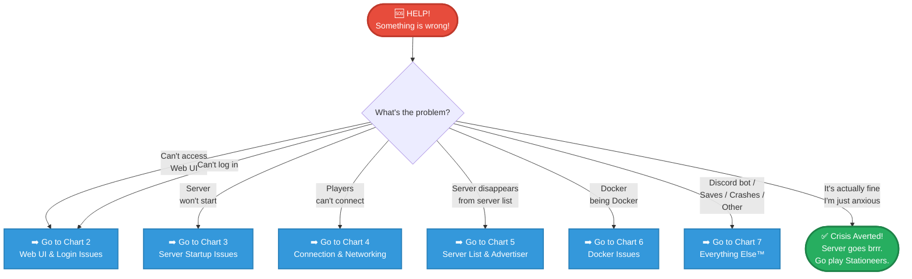
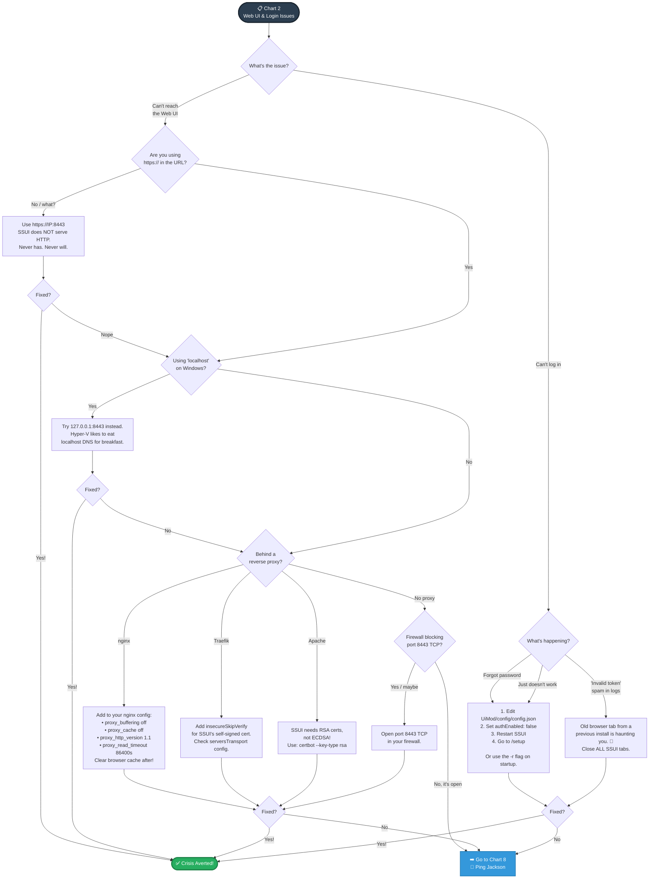
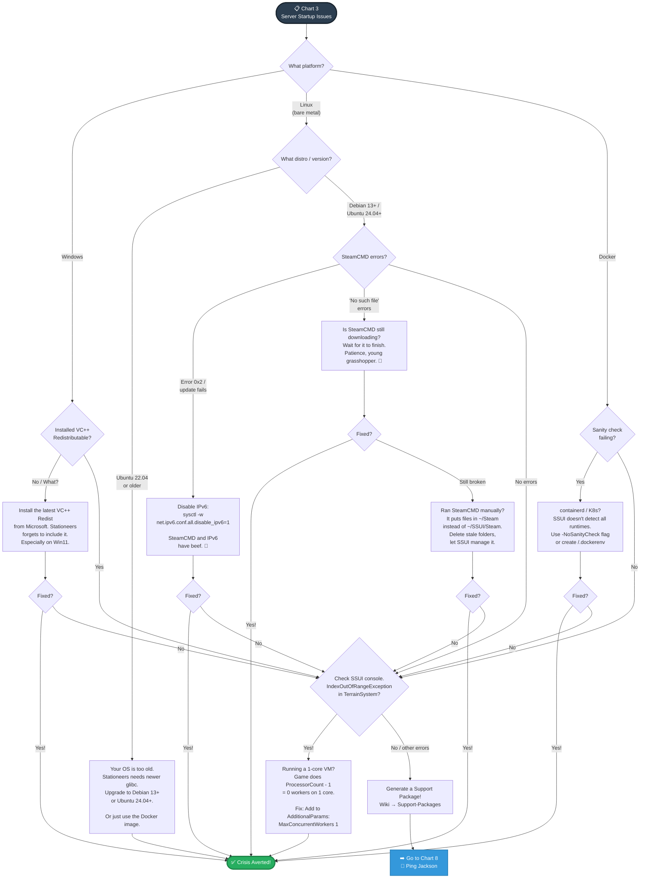
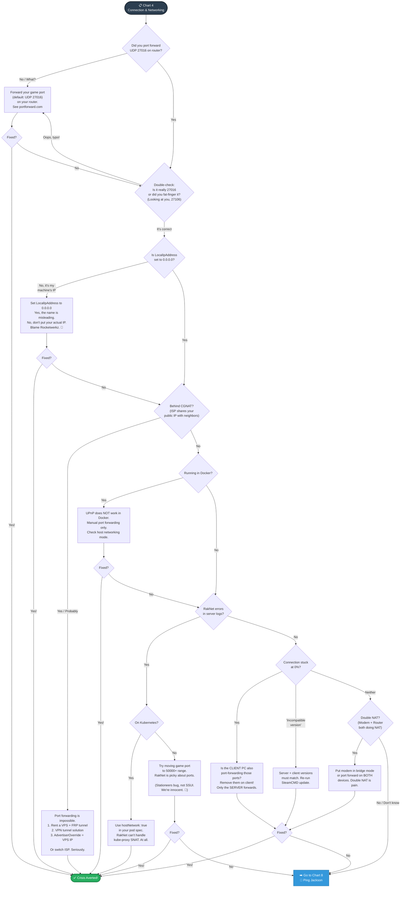
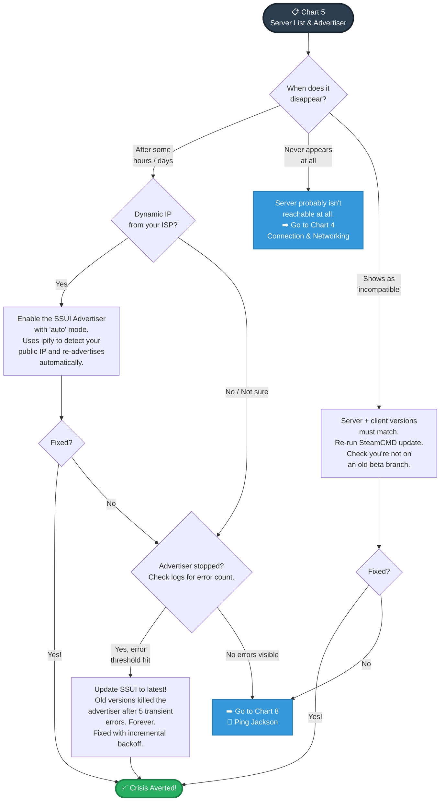
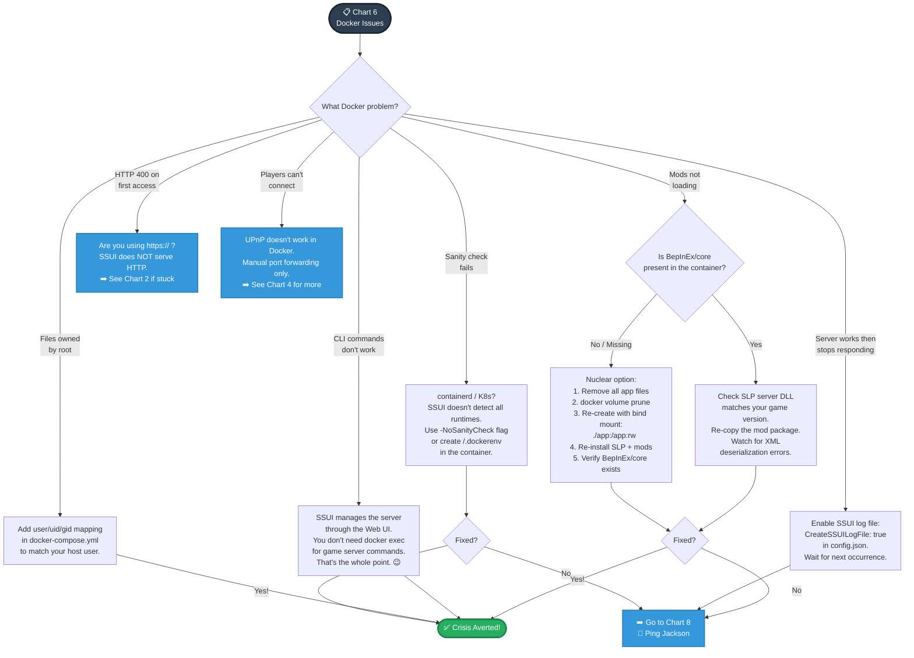
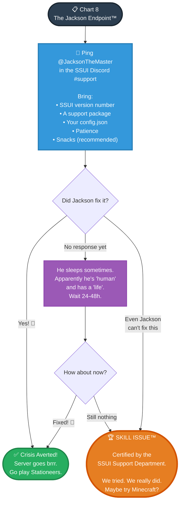

!!! danger "⚠️ LEGACY DOCUMENTATION"
    This page describes the old SSUI v5 documentation and is kept for reference only. It does not describe the current SSUI v6 release, API, paths or security model.

    For a new installation, start with the [current v6 documentation](../../index.md).

# The Holy SSUI Debug Flowchart

> *Based on the Data of ALL support tickets so far*

**Navigation:** Start at [Chart 1](#chart-1-main-triage). Each chart tells you where to go next.

---

## Chart 1 - Main Triage

*Start here. Always.*

---

## Chart 2 - Web UI & Login Issues

*Can't reach the UI or can't log in? Start here.*

---

## Chart 3 - Server Startup Issues

*Server won't start? Find your platform.*

---

## Chart 4 - Connection & Networking

*Server runs but players can't connect? The big one. Deep breaths.*

---

## Chart 5 - Server List & Advertiser

*Server runs, people connected before, but now it vanishes from the list?*

---

## Chart 6 - Docker Issues

*Docker being Docker. A tale as old as containerization itself.*

---

## Chart 7 - Discord Bot, Saves, Crashes & Everything Else™

*The grab-bag chart. If you made it here, things are getting interesting.*

```mermaid
flowchart TD
    ENTRY(["📋 Chart 7\nEverything Else™"]):::header --> CAT{"Pick your poison:"}

    CAT -->|"Discord bot\nacting weird"| DISCORD
    CAT -->|"Save / backup\nproblems"| SAVES
    CAT -->|"Server crashes"| CRASH
    CAT -->|"Something else"| ELSE

    %% --- DISCORD ---
    DISCORD{"What's the bot doing?"}
    DISCORD -->|"403 errors"| OAUTH["Regenerate the bot invite\nwith the updated OAuth URL.\nCheck channel permissions."]
    DISCORD -->|"Spamming\nmessages"| SPAM["Restart SSUI.\nUsually a Stationeers memory\nleak causing repeated events.\nClassic Rocketwerkz moment. 🙄"]
    DISCORD -->|"Retrieve password\nbroken"| BOTPW["Update to SSUI v5.13+\nRace condition was fixed."]
    DISCORD -->|"Save notifications\nmissing"| BOTSAVE["Check Discord OAuth URL\nis up to date."]
    DISCORD -->|"Other"| JACKSON

    OAUTH --> B_OK{"Fixed?"}
    BOTSAVE --> B_OK
    B_OK -->|"Yes!"| RESOLVED
    B_OK -->|"No"| JACKSON
    SPAM --> SP_OK{"Still spamming\nafter restart?"}
    SP_OK -->|"No!"| RESOLVED
    SP_OK -->|"YES"| JACKSON
    BOTPW --> RESOLVED

    %% --- SAVES ---
    SAVES{"What save issue?"}
    SAVES -->|"Server ignores\nmy save"| SNAME["Does SaveName in config\nEXACTLY match folder name?\n\n'Luna' ≠ 'Lunar'\nCase. Matters. Every. Letter."]
    SAVES -->|"Backup manager\nis empty"| SBACKUP["It only watches the\nautosaves directory.\nUse 'file save' to trigger\nautosaves instead."]
    SAVES -->|"Autosave\ncopy broken"| SBUG["Update to SSUI v5.9.1+\nBug after ~2400 autosaves.\nYes, really."]
    SAVES -->|"Commands like\n'say' don't work"| SCMD["Save name mismatch!\nSSCM needs exact world name\nfor command privileges."]
    SAVES -->|"Copied save\nfrom another server"| SCOPY{"SaveName matches\nfolder name?\nPermissions OK?"}

    SNAME --> S_OK{"Fixed?"}
    SCMD --> S_OK
    S_OK -->|"Yes!"| RESOLVED
    S_OK -->|"No"| JACKSON
    SBACKUP --> RESOLVED
    SBUG --> RESOLVED
    SCOPY -->|"Fixed it!"| RESOLVED
    SCOPY -->|"Still broken"| JACKSON

    %% --- CRASHES ---
    CRASH{"When does it crash?"}
    CRASH -->|"During save\noperations"| CSAVE["Update SSUI!\nSSCM had a threading bug:\nsaves ran off the main\nUnity thread. Fixed in PR #119."]
    CRASH -->|"On loading\na save"| CLOAD
    CRASH -->|"Random crashes\nwith mods"| CMODS
    CRASH -->|"Other / random"| COTHER["Generate a Support Package!\nWiki → Support-Packages\nEnable CreateSSUILogFile: true"]

    CSAVE --> RESOLVED
    COTHER --> JACKSON

    CLOAD{"IndexOutOfRange\nor save corruption?"}
    CLOAD -->|"IndexOutOfRange"| CTABLET["Known Stationeers bug:\ntablet cartridge switched\nduring a save operation.\nJackson has a patched DLL."]
    CLOAD -->|"Other error"| COTHER
    CTABLET --> JACKSON

    CMODS{"Crashes without\nmods too?"}
    CMODS -->|"No, mods only"| MODISSUE["Mod issue, not SSUI.\nRunning beta branch?\nGood luck, brave soul. ⚔️"]
    MODISSUE --> SKILL_ISSUE
    CMODS -->|"Yes"| COTHER

    %% --- OTHER ---
    ELSE{"Be more specific:"}
    ELSE -->|"AutoPause\ndoesn't work"| APAUSE["Stationeers game bug.\nSSUI sends the command.\nGame just... ignores it. 🫠"]
    ELSE -->|"Detection manager\nnot firing"| DETECT["Known bug.\nCheck GitHub issues."]
    ELSE -->|"Config changes\ndon't apply"| RESTART{"Restarted SSUI\nafter config change?"}
    ELSE -->|"Run 2 servers\non 1 machine"| DUAL["Change SSUIWebPort in\nconfig.json or use -p=PORT.\nChange game port in\nNetwork settings too."]
    ELSE -->|"Orphan process\nafter update"| ORPHAN["GH issue #159.\nStop server BEFORE updating.\nKill orphan manually via PID."]

    APAUSE --> SKILL_ISSUE
    DETECT --> JACKSON
    RESTART -->|"...no"| RFIX["Restart SSUI. Always\nrestart after config changes.\nALWAYS."] --> RESOLVED
    RESTART -->|"Yes!"| JACKSON
    DUAL --> RESOLVED
    ORPHAN --> RESOLVED

    %% --- TERMINALS ---
    JACKSON["➡️ Go to Chart 8\n📣 Ping Jackson"]:::nav
    RESOLVED(["✅ Crisis Averted!"]):::success
    SKILL_ISSUE(["🏆 SKILL ISSUE™\nCertified by SSUI Support Dept."]):::skillissue

    classDef header fill:#2c3e50,color:#fff,stroke:#1a252f,stroke-width:3px
    classDef success fill:#27ae60,color:#fff,stroke:#1e8449,stroke-width:3px
    classDef skillissue fill:#e67e22,color:#fff,stroke:#d35400,stroke-width:4px
    classDef nav fill:#3498db,color:#fff,stroke:#2980b9,stroke-width:2px
```

---

## Chart 8 - The Jackson Endpoint™

*You've tried everything. There's only one hope left.*

---

## Quick Reference: The Flowchart Cheat Sheet

For those who don't like pictures, here's the TL;DR version:

### Tier 1: Check These First (Solves 60% of tickets)
| Symptom | Fix |
|---|---|
| Can't reach Web UI | Use `https://` not `http://`, port 8443 |
| `localhost` doesn't work on Windows | Use `127.0.0.1` instead (Hyper-V) |
| Forgot password | `authEnabled: false` in config → restart → `/setup` |
| Players can't connect | Port forward UDP 27016 on router |
| "Incompatible version" | Update game server via SteamCMD |
| Server won't start on Windows | Install VC++ Redistributable |

### Tier 2: Platform-Specific Gotchas (Solves another 25%)
| Platform | Gotcha | Fix |
|---|---|---|
| Linux | SteamCMD error 0x2 | Disable IPv6 |
| Linux | Ubuntu 22.04 too old | Upgrade to Debian 13+ / Ubuntu 24.04+ |
| Linux | 1-core VM crash | `MaxConcurrentWorkers 1` in AdditionalParams |
| Docker | UPnP doesn't work | Manual port forwarding only |
| Docker | Containerd not detected | `-NoSanityCheck` flag |
| Docker | Mods broken after volume change | Full cleanup + rebuild with bind mount |
| Docker | Files owned by root | Add `uid`/`gid` to docker-compose |
| Windows | Hyper-V eats localhost | Use `127.0.0.1` |
| Kubernetes | Player disconnects | `hostNetwork: true` in pod spec |

### Tier 3: Networking Nightmares (The hard ones)
| Issue | Fix |
|---|---|
| Behind CGNAT | VPS + FRP tunnel, or VPN |
| Double NAT | Bridge mode on modem, or forward on both devices |
| RakNet errors | Try port 50000+ range; it's a game bug |
| Reverse proxy (nginx) | `proxy_buffering off`, `proxy_cache off`, timeouts |
| Reverse proxy (Apache) | `certbot --key-type rsa` (ECDSA not supported) |
| Reverse proxy (Traefik) | `insecureSkipVerify` for self-signed cert |
| Server disappears from list | Enable SSUI Advertiser with `auto` mode |
| `LocalIpAddress` confusion | Set to `0.0.0.0`, NOT your actual IP |

### Tier 4: Ping @JacksonTheMaster
When all else fails. Bring logs, a support package, and snacks.

### Tier 5: 🏆 Skill Issue™
You've reached the end. We tried.

---

*No Jacksons were harmed in the making of this chart. 3000 GPUs worked hard on this analysis (probably)*
