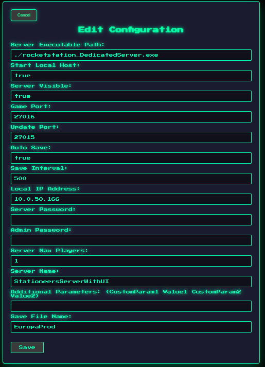
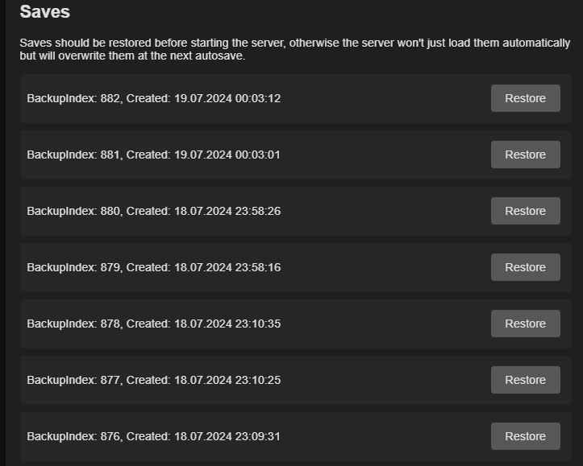

> [!IMPORTANT]
> This project is licensed under the SSUI [LICENSE](LICENSE) and does NOT allow redistribution.
> Instead of forking, join the [Discord](https://discord.gg/8n3vN92MyJ) and state your intentions or [open an issue](https://github.com/SteamServerUI/StationeersServerUI/issues).

# Stationeers Server UI

Managing a Stationeers dedicated server shouldn't require a PhD in Linux or hours of config editing and wiki reading. SSUI gives you a powerful web interface, automated backups, Discord integration, real gameserver connectivity checks and professional server management - all from a single executable. No drama, just a working server. In minutes.

## ✨ Feature Showcase ✨

| 🚀 Easy Setup | 🔒 Secure Access | 🔄 Smart Updates | 🌐 Spacecat | 💾 Smart Backups | 🤖 Discord Hub | 🔌 API v3 | 🧩 Mod Support |
|:-------------:|:----------------:|:----------------:|:-----------:|:---------------:|:--------------:|:---------:|:-------------:|
| Just run and go | Users, TLS and permissions | Major and prerelease aware | Real gameserver port check | Analysed save archives | Status and admin actions | Consistent contract | LaunchPad and Workshop |

### 🌟 This is a WebUI, you don't need a graphical OS to run this 🌟

  

  <em>Manage your Stationeers server with style - retro interface, modern capabilities.</em>

## TL;DR - Get Started Fast

📚 Start with the [Getting started guide](https://ssui.dev/Getting-Started/) in the [SSUI documentation](https://ssui.dev/)

⛓️‍💥 Follow the chained pages (links at the bottom of each page)!

📖 Full documentation is provided at [ssui.dev](https://ssui.dev/).

## What is This?

A sleek, retro-themed web UI to manage your Stationeers dedicated server. No more command line headaches or manual file editing.

### Why You'll Love It

- 🚀 **Simple Setup** - Put SSUI in an empty folder, run it and finish setup in your browser
- 🔌 **Automatic SteamCMD Setup** - No manual SteamCMD installation required
- 🎮 **One-Click Controls** - Start, stop, update and restore through the WebUI
- 🌐 **Spacecat Connectivity Check** - See whether the actual gameserver UDP port can receive traffic from the internet
- 💾 **Smart Backups** - Polling-based detection, save verification, automatic analysis and easy restore
- 🤖 **Your own Discord Bot** - Status, player information, backup actions and admin controls - at your fingertips.
- 🔒 **People and Access** - Multiple users, granular permissions, TLS and scoped personal API tokens
- 🔌 **RESTful API** - A consistent API for automation instead of a collection of random JSON responses
- 🛠️ **SSCLI** - Manage common server operations directly from the terminal
- 🧩 **We 💖 Mods** - StationeersLaunchPad, Workshop downloads and BepInEx integration
- 📦 **Docker Support** - Keep the complete runtime below one `/app` bind mount
- 🔄 **Constant updates** - @JacksonTheMaster always finds something new to add..
Stationeers will still let you destroy the base yourself. We have not patched that out.

## Detailed Documentation

For comprehensive instructions, examples and more details, visit the [SSUI documentation](https://ssui.dev/).

| Documentation Section | Description |
|----------------------|-------------|
| [Features](https://ssui.dev/Features/) | Near-complete list of features and capabilities |
| [Requirements](https://ssui.dev/Requirements/) | System requirements and sizing guidance |
| [Installation](https://ssui.dev/Installation/) | Step-by-step installation guide |
| [First-Time Setup](https://ssui.dev/First-Time-Setup/) | Getting your server up and running |
| [Discord Integration](https://ssui.dev/Discord-Integration/) | Setting up and using the Discord bot |
| [Web Interface](https://ssui.dev/Web-Interface/) | Using the WebUI effectively |
| [Docker Guide](https://ssui.dev/Docker-Guide/) | Running in Docker containers |
| [Security Considerations](https://ssui.dev/Security-Considerations/) | Users, permissions and HTTPS |

## Web UI screenshots

_Click the images to expand them._

| UI Overview | Configuration | Backup Management |
|:-----------:|:------------:|:-----------------:|
|  |  |  |

## Discord screenshots

_Click the images to expand them._

| Connection Log | Save Log | Server Hub | Discord Commands |
|:--------------:|:--------:|:----------:|:----------------:|
|  |  |  |  |

## Contributing

Love this project? I'd love your help making it better! See the [Contributing Guidelines](https://ssui.dev/Contributing/) to get started.

- 🐛 **Found a bug?** [Open an issue](https://github.com/SteamServerUI/StationeersServerUI/issues)
- 💡 **Have an idea?** [Suggest a feature](https://github.com/SteamServerUI/StationeersServerUI/issues/new?labels=enhancement)
- 🤔 **Questions?** [Check the documentation](https://ssui.dev/) or [ask in Discord](https://discord.gg/8n3vN92MyJ).

## License

This project is licensed under the STATIONEERS SERVER UI LICENSE AGREEMENT - see the [LICENSE](LICENSE) file for details.
