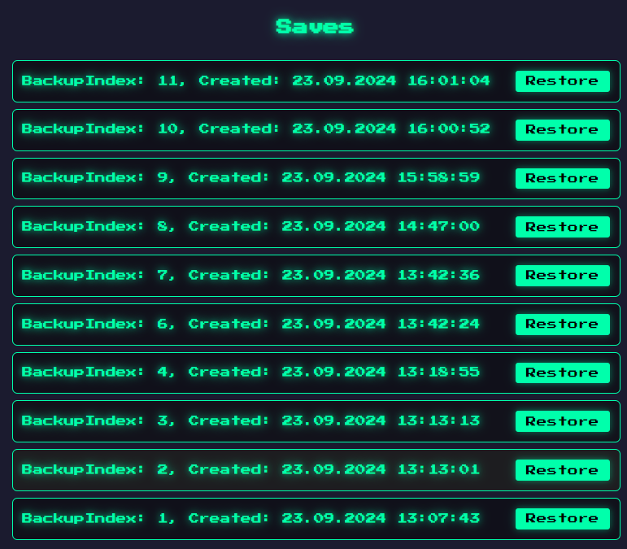

# Stationeers Dedicated Server Control v1.1

Stationeers Dedicated Server Control is a web-based tool for managing a Stationeers dedicated server. It offers an intuitive UI and a robust REST API for server operations, configuration management, and backup handling.
I created this project to make it easier for me to manage my Stationeers server more efficiently, especially to restore backups.
I found that the Stationeers server was not very user-friendly, and I wanted to create a tool that would make it easier to manage the server.
Also I wanted my friends to be able to start, stop and manage the Server without having to ask me to restore the lastest backup because some base exploded. So here we are.

DISCLAIMER: PUBLISHING THIS UI TO THE WEB SHOULD ONLY BE DONE BEHIND A SECURE AUTHENTICATION MECHANISM; THIS SHOULD NOT UNDER ANY CIRCUMSTANCES BE PORT FORWARDED STRAIGHT OUT!

## Features
| UI Overview | Configuration | Backup Management |
|:-----------:|:-------------:|:-----------------:|
|  |  |  |
- Start and stop the server.
- View real-time server output.
- Manage server configurations.
- List and restore backups.
- Fully functional REST API for all operations.

## Requirements
- Windows OS
- Downloaded and installed the Stationeers Dedicated Server.

## Quick Installation Instrcutions for Administrators & Server Operators

1. Download & Extract release ZIP from GitHub.
2. Move "startStatoneersServerUI.exe" and the "UIMod" folder to the server's executable directory.
3. Run "startStatoneersServerUI.exe". (If you start "UIMod/Stationeers-ServerUI.exe", the Server wont auto restart)
4. Access UI at `http://<server-ip>:8080`.
5. Open firewall ports 27015, 27016, 8080.
6. Check /config before starting the server.

## Detailed Installation Instrcutions for "Normal" Windows Users

1. Go to the link: https://github.com/jmgit/stationeers-server-ui/releases.
2. Find the latest release and click to download the ZIP file.
3. Once downloaded, locate the ZIP file, right-click on it, and select "Extract All...".
4. Choose a folder where you want to save the extracted files and click "Extract".
5. Open the folder with the extracted files and locate "startStatoneersServerUI.exe".
6. Cut (Ctrl+X) or copy (Ctrl+C) "startStatoneersServerUI.exe".
7. Navigate to the folder where you have installed your Stationeers Dedicated Server.
8. Paste (Ctrl+V) "startStatoneersServerUI.exe" into this folder.
9. Go back to the extracted files folder and find the "UIMod" folder.
10. Cut (Ctrl+X) or copy (Ctrl+C) the "UIMod" folder.
11. Paste (Ctrl+V) the "UIMod" folder into the same folder where your Stationeers Dedicated Server executable is located.
13. Double-click "startStatoneersServerUI.exe" to run it. Do not run "UIMod/Stationeers-ServerUI.exe" unless you DONT want the server to auto restart.
14. Open your web browser and type `http://<IP-OF-YOUR-SERVER>:8080` in the address bar. Replace `<IP-OF-YOUR-SERVER>` with the actual IP address of your server. You can find this by opening the Command Prompt and typing `ipconfig`.
15. To allow other users to connect to your UI and the Server, open the Windows Firewall settings:
    - Go to Control Panel > System and Security > Windows Defender Firewall.
    - Click "Advanced settings" on the left.
    - In the Windows Firewall with Advanced Security window, click "Inbound Rules" on the left.
    - Click "New Rule..." on the right.
    - Select "Port" and click "Next".
    - Choose "TCP" and enter "27015, 27016, 8080" in the Specific local ports field. Click "Next".
    - Allow the connection and click "Next".
    - Select the network types to apply this rule (usually Domain, Private, and Public) and click "Next".
    - Name the rule something recognizable (e.g., "Stationeers Server Ports") and click "Finish".
    - __Note__:  Depending on your Setup, you might need to Port forward those ports on your router. For this, please consider using google or any other search engine exept bing to find a tutorial on how to do this.
16. Before starting your server, ensure the configuration files on the /config page are set up correctly.

## REST API Information

This server is based on Go, so it's basically a REST-API with some HTML files on top. All UI actions are API calls, so you can fully use the API to control the server.

### API Endpoints

- **Start Server**: `/start` (GET)
- **Stop Server**: `/stop` (GET)
- **Get Server Output**: `/output` (GET)
- **List Backups**: `/backups` (GET)
- **Restore Backup**: `/restore?index=<index>` (GET)
- **Edit Configuration**: `/config` (GET)
- **Save Configuration**: `/saveconfig` (POST Form Data)

### Form Data Explanation

- **SaveFileName**: The name of the save file to load. This is the name of the file without the extension. Example: `Mars`.
- **Settings**: The server settings. Use the UI to get the correct settings if you're unsure.

## UI

The web interface provides buttons to start and stop the server, edit configuration, and manage backups. The current server status and console output are displayed in real-time.

## License

This project is licensed under the MIT License. See the LICENSE file for details.

## Contributing

Contributions are welcome! Feel free to open issues or submit pull requests!

## Acknowledgments

- [JacksonTheMaster](https://github.com/JacksonTheMaster) Developed with ❤️ and 💧 by J. Langisch.
- [Go](https://go.dev/) for the Go programming language.
- [RocketWerkz](https://github.com/RocketWerkz) for creating the Stationeers game.
